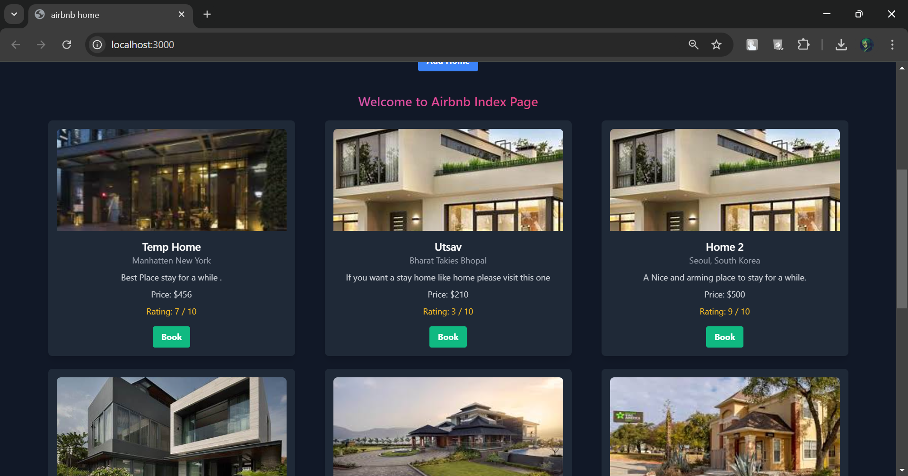
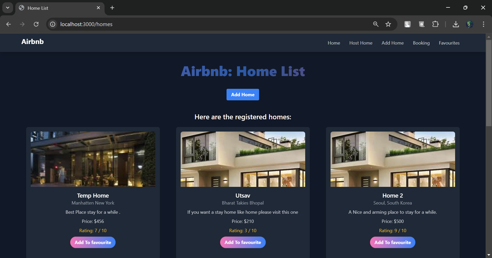
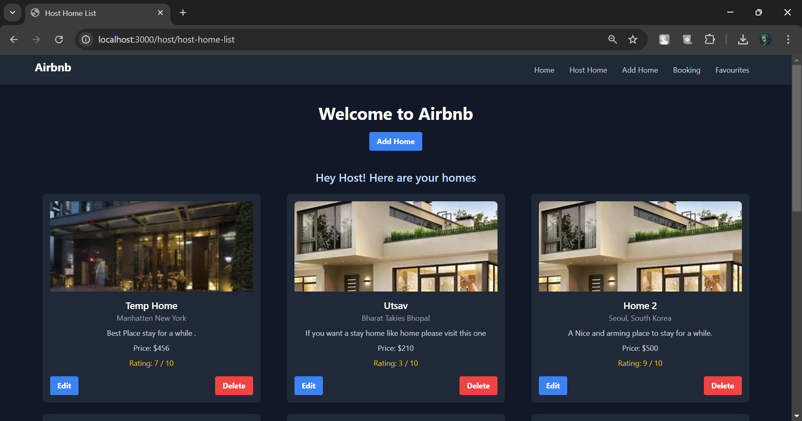
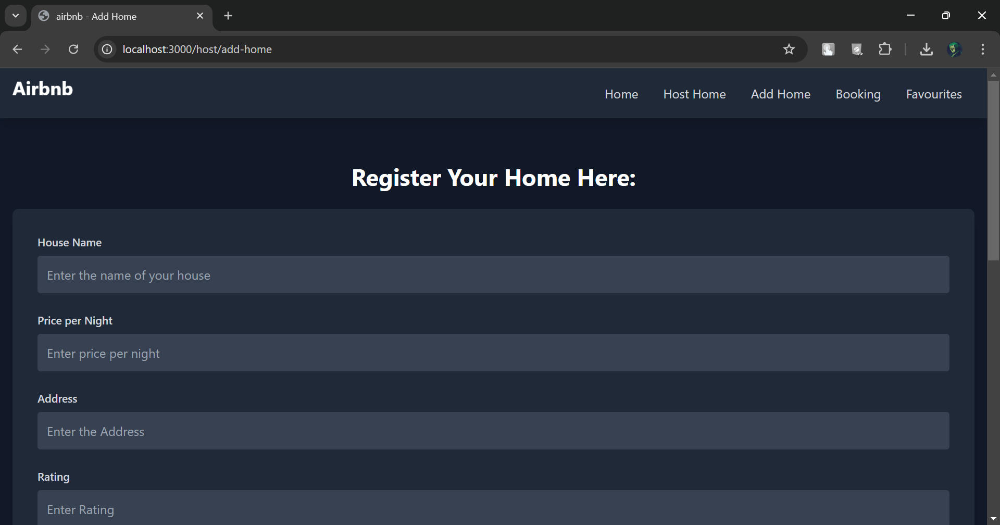
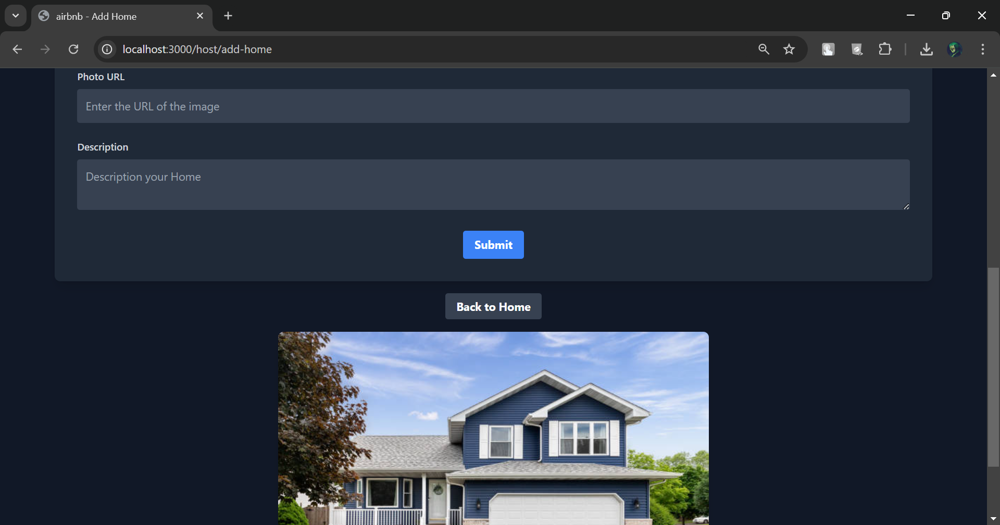
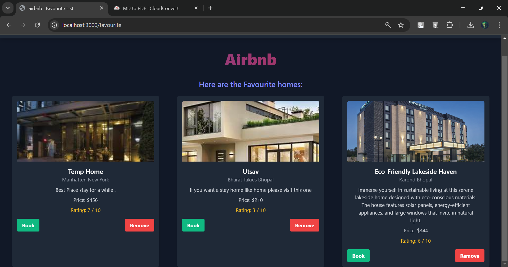
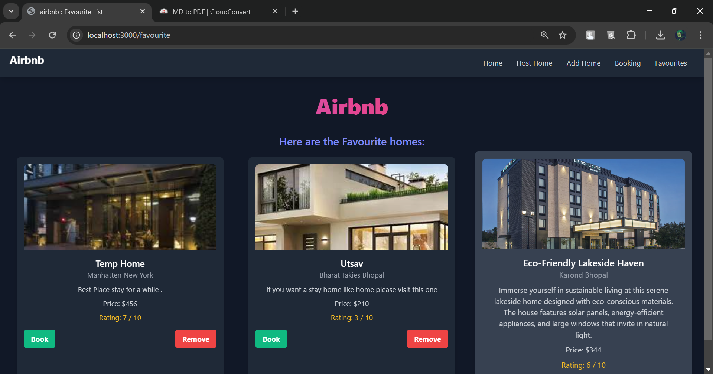

# Airbnb MongoDB

This project is part of the Node Course and focuses on integrating MongoDB with an Airbnb-like application.

## Developer

Mohammad Zaid Khan

## Table of Contents

- [Introduction](#introduction)
- [Installation](#installation)
- [Usage](#usage)
- [Features](#features)
- [Technologies](#technologies)
- [Database Schema](#database-schema)

## Introduction

In this lecture, we will learn how to use MongoDB to store and manage data for an Airbnb-like application. We will cover the basics of MongoDB, how to connect it with a Node.js application, and perform CRUD operations.

## Installation

1. Clone the repository:

```bash
git clone https://github.com/yourusername/airbnb-mongodb.git
```

2. Navigate to the project directory:

```bash
cd airbnb-mongodb
```

3. Install the dependencies:

```bash
npm install
```

4. Set up your MongoDB database and update the connection string in the `.env` file.

## Usage

1. Start the application:

```bash
npm start
```

2. Open your browser and navigate to `http://localhost:3000`.

## Features

- User authentication and authorization
- Listing properties
- Booking properties
- Managing user profiles

## Technologies

- Node.js
- Express.js
- MongoDB
- Mongoose

## Database Schema

The following schema is used in this project:

```javascript
const { ObjectId } = require("mongodb");
const { getdb } = require("../utils/database");

module.exports = class Home {
  constructor(houseName, price, address, rating, photo, description, _id) {
    this.houseName = houseName;
    this.price = price;
    this.rating = rating;
    this.address = address;
    this.photo = photo;
    this.description = description;
    if (_id) {
      this._id = _id;
    }
  }
  save() {
    const db = getdb();
    return db.collection("homes").insertOne(this);
  }
  static fetchAll() {
    const db = getdb();
    return db.collection("homes").find().toArray();
  }

  static findById(homeId) {
    const db = getdb();
    return db
      .collection("homes")
      .find({ _id: new ObjectId(String(homeId)) })
      .next();
  }
  static deleteById(homeId) {
    const db = getdb();
    return db
      .collection("homes")
      .deleteOne({ _id: new ObjectId(String(homeId)) })
      .next();
  }
  updateById() {
    const db = getdb();
    const updateData = { ...this };
    delete updateData._id; // Avoid including _id in the update
    return db
      .collection("homes")
      .updateOne({ _id: new ObjectId(String(this._id)) }, { $set: updateData });
  }
};
```

## Screenshot

Here are the screenshots of the project in action:









